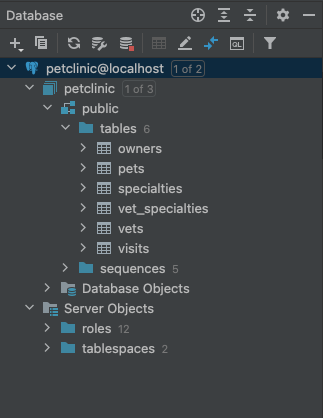

# Final task for QA Automation Course 

[Read more about the course](https://github.com/eugene-krivosheyev/qa-automation-java#readme)

### Run backend application storing its data with PostgreSQL both dockerized 
```
cd spring-pet-clinic-rest

docker-compose up
```

- [x] Done

### Check database schema provisioning with any suitable DB client



- [x] Done

### Document run instructions with README.md

See `readme-task.md`

- [x] Done

### Implement run with docker-compose.yml

See `docker-compose.yml`

To run docker-compose use
```docker-compose up```

- [x] Done

### Develop REST API autotests with quality criteria

- self-describing
- isolated
- coverage of CRUD main flows for core domain entities/resources


- [x] Done

### Describe bugs found in backend business-logic with FIXME.md

See `FIXME.md`

- [x] Done

### Implement correct TO-BE scenarios as `@Disabled` auto-tests with `@DisplayName` and `/** Javadoc comments */` describing bugs found

- [x] Done

### Fix bugs in backend java code

Gave up after 3 hours

- [ ] Done

### Develop GitLab build pipeline

- [ ] Done
